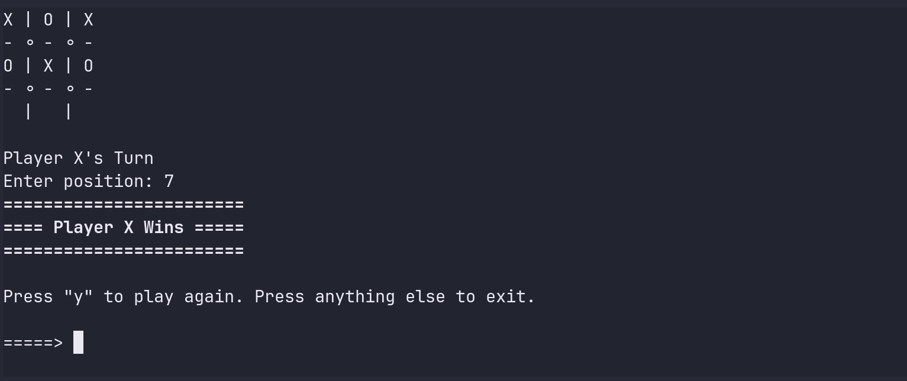

# Intro

This is my first golang project and I learned a lot from it. I learned all of the basic syntax of Go by building this game. I built this without looking at any existing logic so it might not be the optimal way of creating it.

# Screenshot



# How to play

Clone this repository anywhere in your machine. `cd` into the `TicTacToe` directory. You can either run the code directory or build and run it.

```
go run .main.go
```

```
go build main.go
./main
```

> If you are using Windows machine building will create an exe file so run it using `./main.exe`

# Key Feature

- The key feature in this code is that it uses an alternate screen buffer to show the output. It's actually the reason I built this game. When I discovered what alternate screen buffers are I decided that I have to build a simple game with it.
