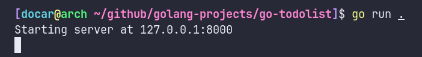
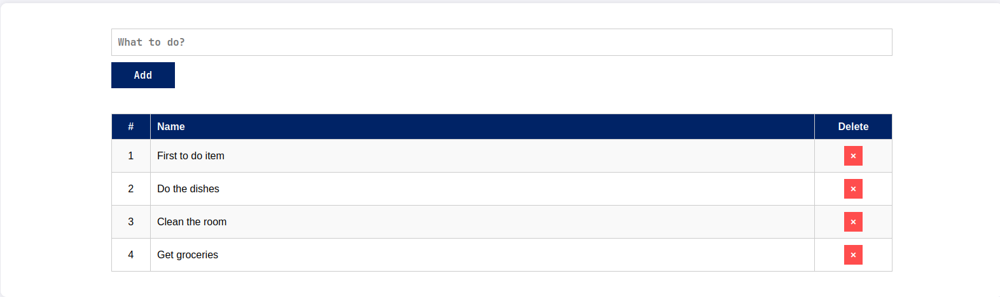

# Introduction

This is a todo list web application I created only using the go standard library. I learned how to create a basic webserver by following along a [tutorial by Akhil Sharma](https://www.youtube.com/watch?v=ASBUp7stqjo). A key note is that this application does not use any javascript so its very fast in terms of response.

> Note: The css of this project is entirely generated using chatgpt. I have adjusted the generated css slightly to fit my needs.

# Screenshots

#### Terminal Output



#### Web Output



# How to run

Clone this repository anywhere in your machine. `cd` into the go-todolist directory. You can either build this code or run it directly using go. by default the app will run in localhost with port 8000 but you can change it for your needs.

```
go run .

# Or expose it to network using wildcard ip
go run . 0.0.0.0:8000
```

```
go build .
./go-todolist

# Or expose it to network using wildcard ip
./go-todolist 0.0.0.0:8000
```

> If you are using Windows machine building will create an exe file so run it using `./go-todolist.exe` or `./go-todolist.exe 0.0.0.0:8000`

# API Endpoints

`/`: This dynamically renders the todolist contents

`/newtodo`: This endpoint runs when the add button is clicked. It reads the input box and adds a new todo entry in the todos slice

`/deletetodo`: This endpoint is run when a delete button is pressed against a todo item. It using the item's id and removes it from the todos slice
